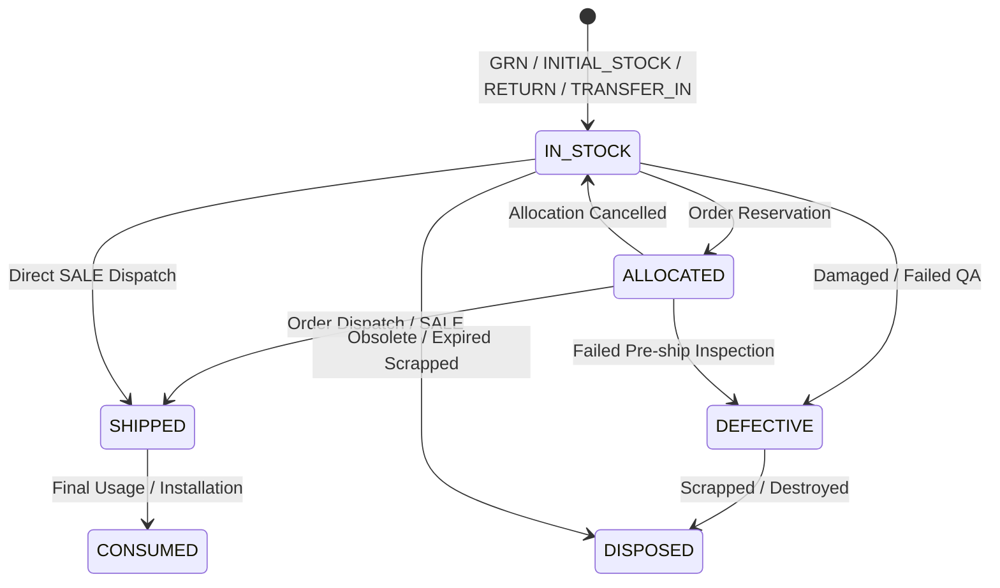

# DEADLINEOS BUSINESS OPERATIONS — MILESTONE C3.3 ARCHITECTURE REVIEW
# SERIAL NUMBER TRACKING & UNIT-LEVEL PROVENANCE

**Document ID**: `C3-3-ARCH-001`
**Milestone**: Phase C3.3 (Serial Number Tracking & Unit-Level Provenance)
**Baseline Revision**: `14e850d`
**Status**: REVIEWED & APPROVED

---

## 1. Domain Entities & Database Schema

### 1.1 `business_products` Extension
Extend existing `business_products` table:
- Column `is_serialized`: `Boolean`, `NOT NULL`, `default=False`, indexed.
- Backward compatibility: All existing products default to `False`. Non-serialized operations behave identically to prior baselines.

### 1.2 `business_serial_numbers` (Unit-Level Provenance Registry)
Authoritative entity tracking individual serialized physical units:
```sql
CREATE TABLE business_serial_numbers (
    id VARCHAR(36) PRIMARY KEY,
    workspace_id VARCHAR(36) NOT NULL REFERENCES business_workspaces(id) ON DELETE CASCADE,
    product_id VARCHAR(36) NOT NULL REFERENCES business_products(id) ON DELETE CASCADE,
    serial_number VARCHAR(100) NOT NULL,
    batch_id VARCHAR(36) REFERENCES business_batches(id) ON DELETE SET NULL,
    goods_receipt_id VARCHAR(36) REFERENCES business_goods_receipts(id) ON DELETE SET NULL,
    current_location_id VARCHAR(36) REFERENCES business_locations(id) ON DELETE SET NULL,
    status VARCHAR(20) NOT NULL DEFAULT 'IN_STOCK',
    received_at TIMESTAMP WITH TIME ZONE NOT NULL DEFAULT CURRENT_TIMESTAMP,
    allocated_at TIMESTAMP WITH TIME ZONE,
    shipped_at TIMESTAMP WITH TIME ZONE,
    consumed_at TIMESTAMP WITH TIME ZONE,
    defective_at TIMESTAMP WITH TIME ZONE,
    disposed_at TIMESTAMP WITH TIME ZONE,
    quarantine_reason TEXT,
    notes TEXT,
    created_at TIMESTAMP WITH TIME ZONE NOT NULL DEFAULT CURRENT_TIMESTAMP,
    updated_at TIMESTAMP WITH TIME ZONE NOT NULL DEFAULT CURRENT_TIMESTAMP,
    CONSTRAINT uq_biz_serial_ws_prod_num UNIQUE (workspace_id, product_id, serial_number),
    CONSTRAINT chk_biz_serial_status CHECK (status IN ('IN_STOCK', 'ALLOCATED', 'SHIPPED', 'CONSUMED', 'DEFECTIVE', 'DISPOSED'))
);
```
Indexes:
- `idx_biz_serial_ws_prod_status` on `(workspace_id, product_id, status)`
- `idx_biz_serial_ws_batch` on `(workspace_id, batch_id)`
- `idx_biz_serial_ws_loc` on `(workspace_id, current_location_id)`

### 1.3 `business_stock_movement_serials` (Attribution Ledger)
Links authoritative stock movements to specific serialized units:
```sql
CREATE TABLE business_stock_movement_serials (
    id VARCHAR(36) PRIMARY KEY,
    workspace_id VARCHAR(36) NOT NULL REFERENCES business_workspaces(id) ON DELETE CASCADE,
    stock_movement_id VARCHAR(36) NOT NULL REFERENCES business_stock_movements(id) ON DELETE CASCADE,
    serial_id VARCHAR(36) NOT NULL REFERENCES business_serial_numbers(id) ON DELETE RESTRICT,
    created_at TIMESTAMP WITH TIME ZONE NOT NULL DEFAULT CURRENT_TIMESTAMP,
    CONSTRAINT uq_biz_sm_serial UNIQUE (stock_movement_id, serial_id)
);
```

---

## 2. Deterministic Lifecycle State Machine



### Valid Transition Matrix
| Source State | Target State | Triggering Operational Event | Permission Required |
| :--- | :--- | :--- | :--- |
| `None` (New) | `IN_STOCK` | GRN receipt, Initial stock, Return | `serial:write` |
| `IN_STOCK` | `ALLOCATED` | Sales order reservation | `serial:write` |
| `ALLOCATED` | `IN_STOCK` | Allocation cancellation | `serial:write` |
| `IN_STOCK` / `ALLOCATED` | `SHIPPED` | Outbound dispatch / SALE stock movement | `serial:write` |
| `SHIPPED` | `CONSUMED` | Installation / commissioning confirmation | `serial:write` |
| `IN_STOCK` / `ALLOCATED` | `DEFECTIVE` | Quality failure / damage report | `serial:quarantine` |
| `IN_STOCK` / `DEFECTIVE` | `DISPOSED` | Scrap / formal disposal | `serial:quarantine` |

Any transition outside this explicit matrix is rejected server-side with `INVALID_LIFECYCLE_TRANSITION` (HTTP 400).

---

## 3. Stock Movement Integration & Ledger Integrity

1. **Exact Quantity Invariant**:
   For any stock movement involving a serialized product:
   $$\sum_{s \in \text{Serials}} 1 = \text{movement.quantity}$$
   If `count(serials) != movement.quantity`, the operation is atomically aborted with `SERIAL_COUNT_MISMATCH` (HTTP 400).

2. **Negative Serial Stock Prevention**:
   An outbound movement (`direction == 'OUT'`) can only consume serials currently in `IN_STOCK` or `ALLOCATED` state located at `movement.location_id`.
   Attempting to dispatch a serial that is `SHIPPED`, `DEFECTIVE`, or `DISPOSED` raises `SERIAL_NOT_AVAILABLE` (HTTP 400).

3. **Concurrency & Double-Spend Defense**:
   When dispatching serials, the domain service acquires an explicit row lock (`with_for_update()`) on the `business_serial_numbers` records within the transaction. This guarantees that two concurrent dispatch requests attempting to consume the same serial will serialize, with the second request immediately encountering `SERIAL_NOT_AVAILABLE`.

4. **Single-Location Invariant**:
   A serial unit has `current_location_id == location_id` while in stock.
   When transferred between locations (`TRANSFER_OUT` $\rightarrow$ `TRANSFER_IN`), the serial's location is atomically updated to maintain exact physical provenance.

---

## 4. Cross-Border & Batch Synergy

If a movement specifies both batch attributions and serial attributions:
- Every serial unit's `batch_id` must match one of the batches attributed to the stock movement.
- If a serial belongs to `Batch A` but the movement was attributed to `Batch B`, the transaction rejects with `BATCH_SERIAL_MISMATCH` (HTTP 400).
- If the parent batch is `QUARANTINED`, any attempt to dispatch serials belonging to that batch is blocked by the batch safety rules established in C3.2.
