<!-- 1. Hero Banner -->
<div align="center">
  <h1>DeadlineOS</h1>
  <p><b>The Enterprise AI Executive Operating System</b></p>

  []()
  []()
  []()
  []()
</div>

---

## 2. Executive Overview
**What is DeadlineOS?**
DeadlineOS is a comprehensive, AI-native executive intelligence platform. It moves beyond passive task tracking into active schedule orchestration, simulating future workload capacity against real-world constraints to act as an autonomous Chief of Staff.

**The Problem Solved**
Traditional task managers fail because they wait for the user to miss deadlines. High-performance individuals suffer from schedule density blindness.

**Target Users**
Engineered for high-performance individuals, students, founders, and professional teams who require predictive analytics to avoid burnout and missed milestones.

**Key Differentiators**
- **Proactive Interventions**: Evaluates schedule integrity to intercept workload collisions before they happen.
- **Multimodal Intelligence**: Accepts commands via Voice, Vision (screenshots/whiteboards), and Documents.
- **Monte-Carlo Digital Twin**: Mathematically simulates your success rate on upcoming goals.

---

## 3. Key Features

**AI Planning & Coordination**
- **AI Planner**: Auto-schedules tasks by finding calendar whitespace without violating burnout thresholds.
- **Goals & Habits**: Tracks long-term objectives linked directly to daily atomic habits.
- **Smart Calendar**: Real-time aggregation of goals, meetings, and deadlines into a single pane of glass.

**Multimodal Intelligence**
- **Voice Intelligence**: Hands-free natural language parsing to execute complex CRUD workflows.
- **Vision Intelligence**: Extracts tasks and constraints from uploaded images or whiteboards.
- **Document Intelligence**: Semantically chunks PDFs and DOCX files into tracked milestones.

**Executive Defense**
- **Digital Twin**: Simulates completion trajectories by analyzing past velocity against future workload.
- **Rescue Center**: Detects at-risk tasks and auto-generates multi-step recovery strategies.
- **Command Center**: Global floating terminal for instant AI interactions from anywhere in the OS.

**Observability & Security**
- **Analytics**: Executive observatory tracking AI confidence scores and completion velocity.
- **Authentication**: Stateless, enterprise-grade tenant isolation.
- **Settings**: Complete control over AI aggressiveness, UI themes, and data management.

---

## 4. Screenshots

<details open>
<summary><b>Click to expand the Gallery</b></summary>
<br>

**Landing & Authentication**
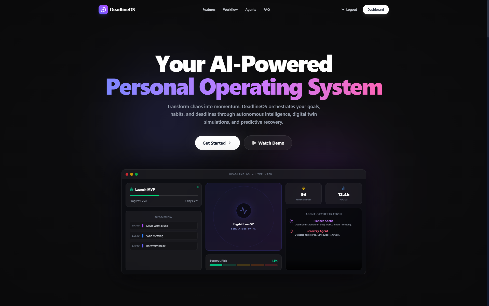

**Dashboards**
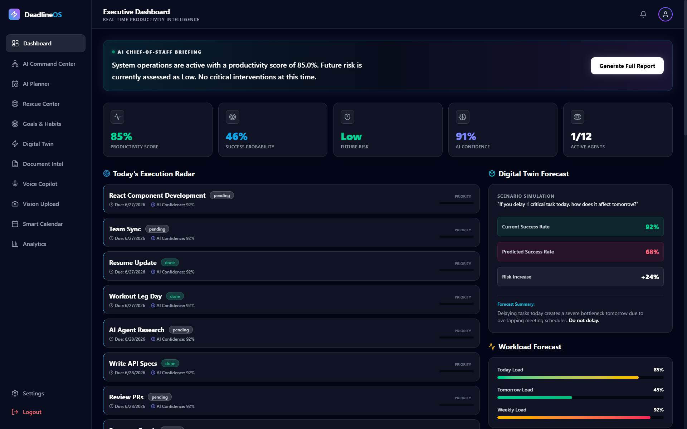

**Planning Matrix**
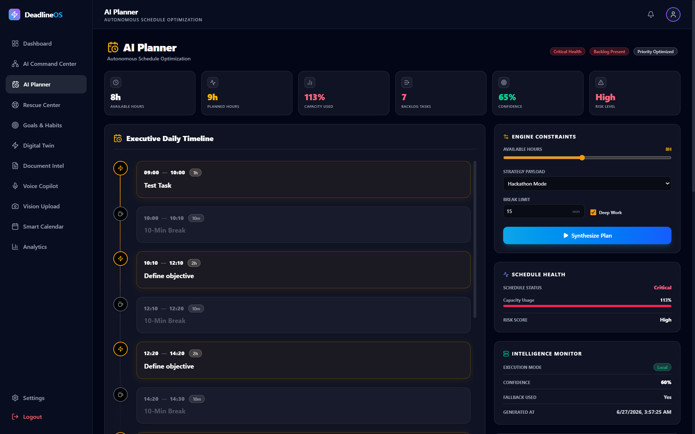
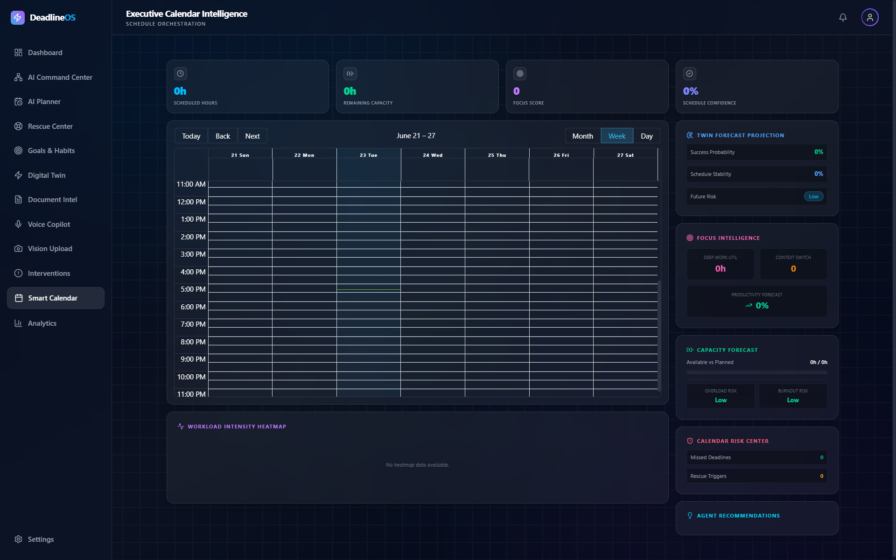
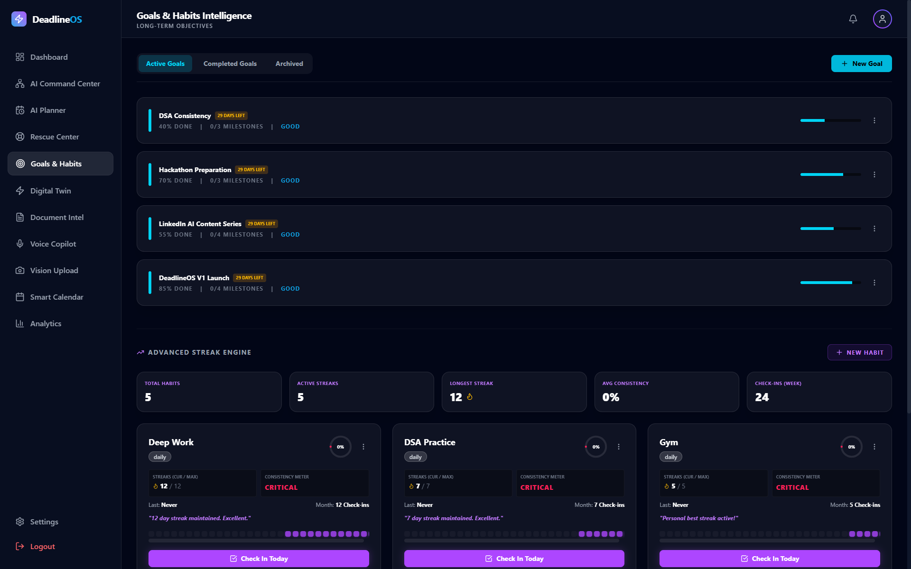

**Intelligence Inputs**
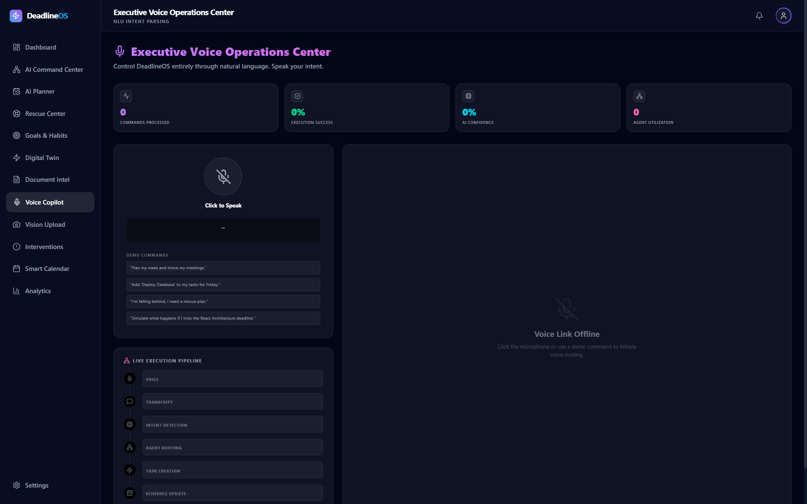
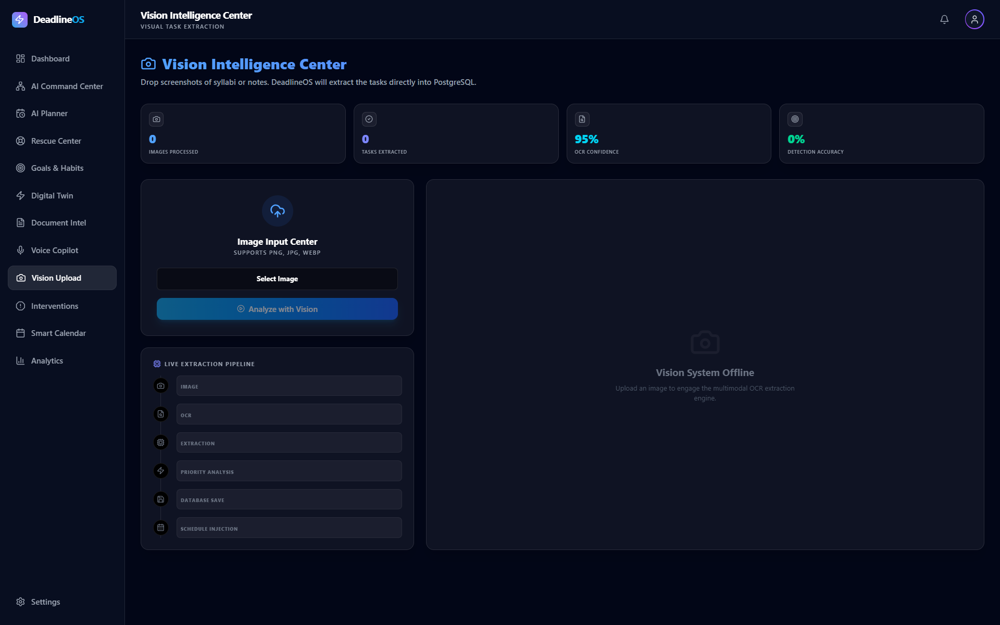
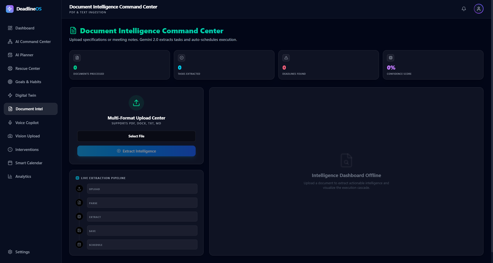
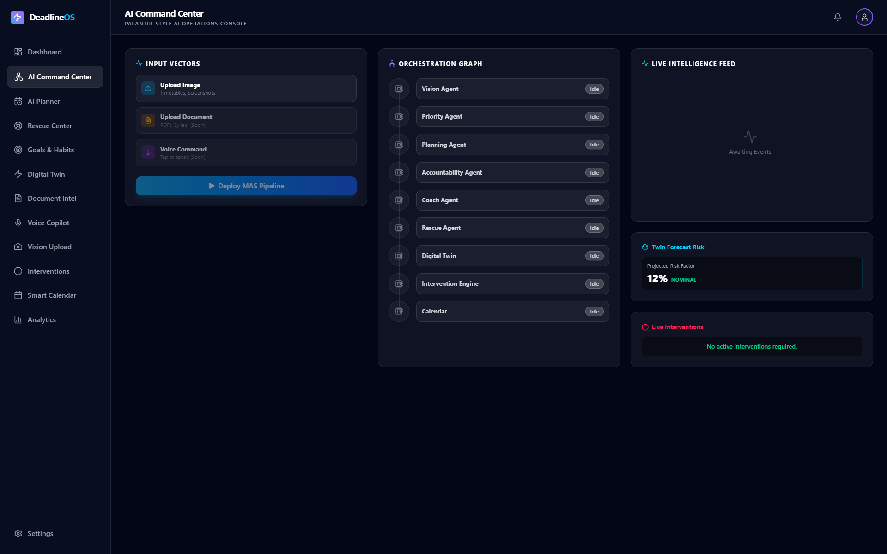

**Executive Defense Operations**
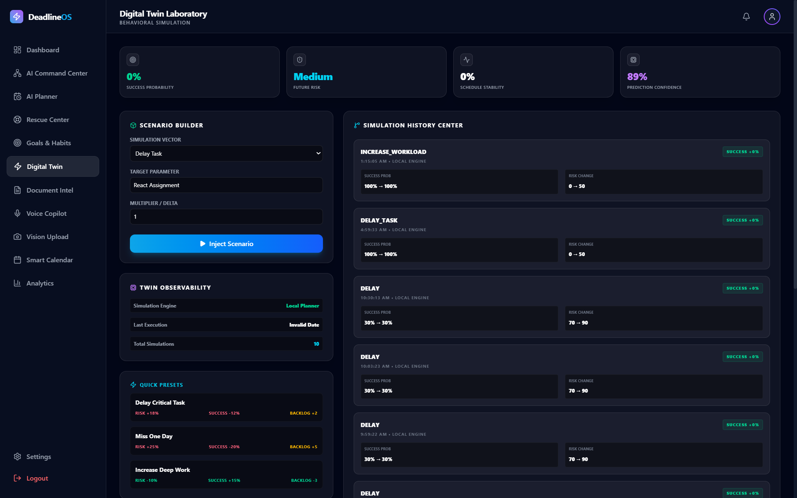
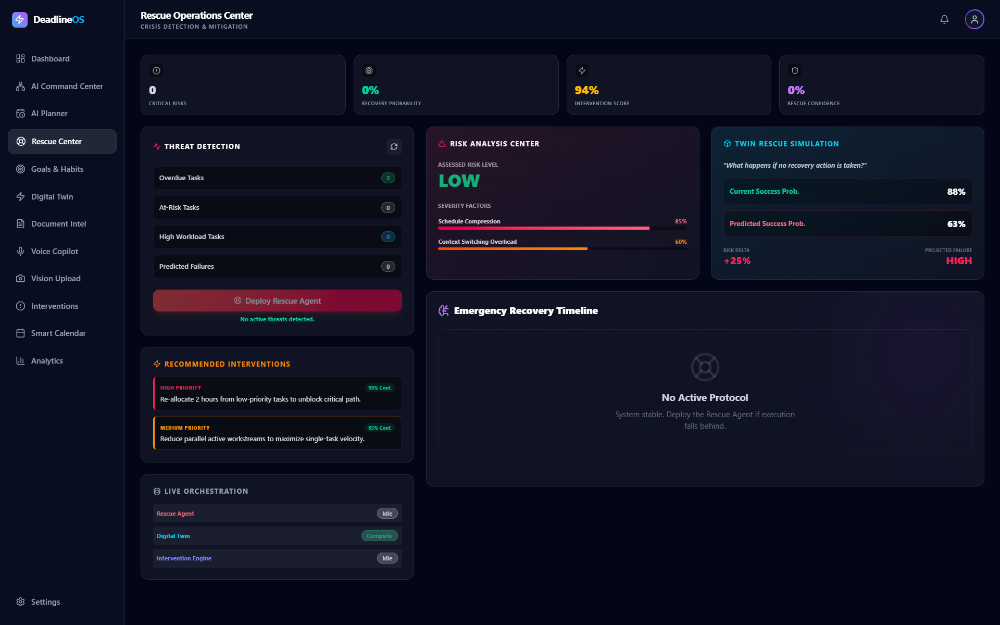
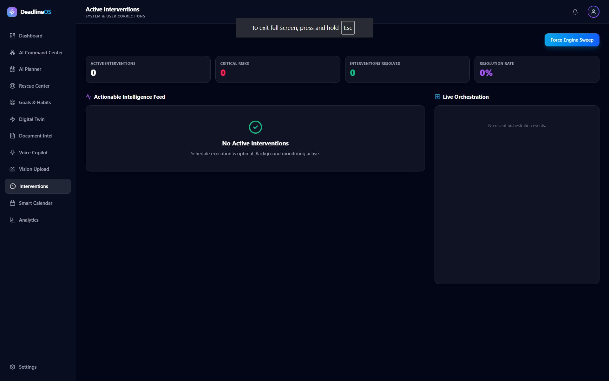

**Observability & Settings**
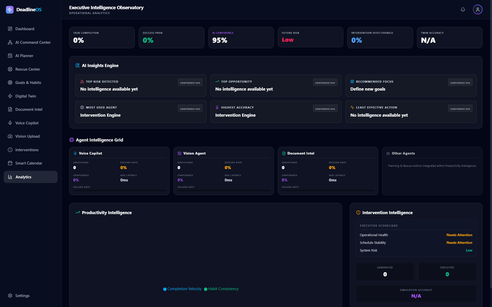

*(Missing visual representations: Settings, Profile, Notifications due to PII isolation)*
</details>

---

## 5. Architecture
DeadlineOS relies on a Hybrid Inference Model built on modern cloud primitives.

- **Frontend**: A high-performance Vite SPA optimized for speed. Communicates via REST and WebSockets.
- **Backend**: A modular Python Application Factory. Implements a globally injected Local Intelligence Engine.
- **Database**: Connection-pooled serverless PostgreSQL optimized for multi-tenant isolation.
- **Authentication**: Asymmetric stateless JWT verification at the routing layer.
- **Deployment**: Vercel handles static edge caching; Render orchestrates the Python worker environments.
- **Local Intelligence Engine**: Processes basic NLP (intent classification, entity extraction) entirely on-device/in-memory with <150ms latency.
- **Gemini Fallback**: Used only when local confidence drops below a threshold, ensuring privacy and speed without sacrificing complex reasoning.

---

## 6. AI Architecture

The system standardizes all intelligence through a unified Execution Engine.

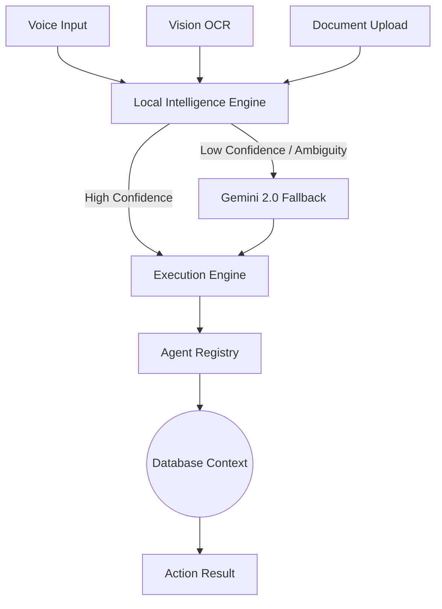

---

## 7. Tech Stack

- **Frontend**: React 19, TypeScript, Vite, TailwindCSS 4, Framer Motion
- **Backend**: Python 3.13, Flask, SQLAlchemy, Eventlet
- **Database**: Neon Serverless PostgreSQL
- **Authentication**: Supabase Auth (JWT)
- **Deployment**: Vercel (Client), Render (API)
- **AI**: Google Gemini 2.0 Flash + RapidFuzz (Local NLP)
- **Monitoring**: Sentry (Application Tracing)

---

## 8. Folder Structure

```text
DeadlineOS/
├── backend/
│   ├── api/            # API Route boundaries
│   ├── database/       # SQLAlchemy configuration
│   ├── models/         # ORM definitions
│   ├── scripts/        # Migrations and maintenance tools
│   ├── services/       # Core business & AI execution logic
│   └── utils/          # Security, auth, and error handlers
├── docs/               # Screenshots, archives, and certifications
├── frontend/
│   ├── public/         # Static assets
│   ├── src/
│   │   ├── api/        # Axios configurations
│   │   ├── components/ # Reusable React UI elements
│   │   ├── context/    # Global State (Auth, Theme)
│   │   ├── hooks/      # Custom React hooks
│   │   ├── lib/        # Utility libraries (Supabase)
│   │   └── pages/      # Route-level views
│   └── package.json    # Frontend dependencies
└── README.md
```

---

## 9. Installation

### 1. Database & External Services
- Create a **Neon PostgreSQL** database.
- Create a **Supabase** project.
- Obtain a **Google Gemini API Key**.

### 2. Environment Variables
Create `.env` files from `.env.example` templates in both `frontend/` and `backend/`.

### 3. Backend Setup
```bash
cd backend
python -m venv .venv
source .venv/bin/activate  # (Windows: .venv\Scripts\activate)
pip install -r requirements.txt
python app.py
```

### 4. Frontend Setup
```bash
cd frontend
npm install
npm run dev
```

---

## 10. Deployment

DeadlineOS is production-ready for standard platforms.

- **Render (Backend)**: Create a Web Service linked to your GitHub repo. Set Root Directory to `backend`. Build Command is `pip install -r requirements.txt`. Start Command is `gunicorn 'app:create_app()' --worker-class eventlet -w 1 --bind 0.0.0.0:$PORT`.
- **Vercel (Frontend)**: Link repo, set Framework Preset to `Vite`, Root Directory to `frontend`. Ensure `vercel.json` is present for SPA routing.
- **Neon**: Retrieve your Transaction Pooler URL (usually port 6543) and append `?sslmode=require`.
- **Supabase**: Update your Site URL and Redirect URLs to point to your Vercel domain.

---

## 11. Performance
DeadlineOS prioritizes perceived and absolute speed:
- **Local-First AI**: 90% of structural intelligence happens locally via NLP algorithms, bypassing network latency.
- **Lazy Loading**: Route-level React component chunking reduces initial bundle sizes to <300kb.
- **Optimistic Updates**: UI predicts successful backend executions instantly.
- **Caching**: The Execution Engine aggressively caches repeated Gemini prompts.

---

## 12. Security
- **JWT**: Stateless validation using Supabase's asymmetric signature verifications. No symmetric keys are manually shared.
- **Supabase Auth**: Strictly handles user identity and isolation natively.
- **Environment Variables**: No credentials committed. Git exclusions hardened.
- **Rate Limiting**: `flask-limiter` implemented at the global application boundary.
- **Input Validation**: Handled strictly via Marshmallow schemas and SQLAlchemy parameterized mapping to prevent SQLi/XSS.

---

## 13. Roadmap
- **v1.0**: Core operating system, AI Command Center, Local Intelligence Engine. *(Completed)*
- **v1.1**: OAuth Google Calendar native syncing. Webhook ingestion API.
- **v2.0**: Native Mobile Apps (React Native). Multi-tenant organizational teams.

---

## 14. Contributing
Contributions are welcome. Please adhere to the following workflow:
1. Fork the repository.
2. Create your feature branch (`git checkout -b feature/AmazingFeature`).
3. Commit your changes utilizing Conventional Commits.
4. Push to the branch (`git push origin feature/AmazingFeature`).
5. Open a Pull Request.

Ensure all backend tests pass (`pytest tests/`) and the frontend lints correctly (`npm run lint`).

---

## 15. License
Distributed under the MIT License. See `LICENSE` for more information.

---

## 16. Author
**Sujith Kumar Sanisetty**
- **LinkedIn**: [Connect on LinkedIn](https://www.linkedin.com/in/s-sujith-kumar-802059298)
- **GitHub**: [sujith0466](https://github.com/sujith0466)
