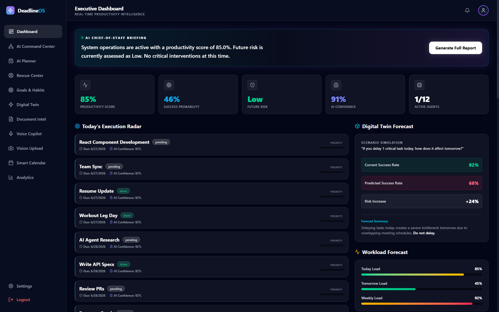
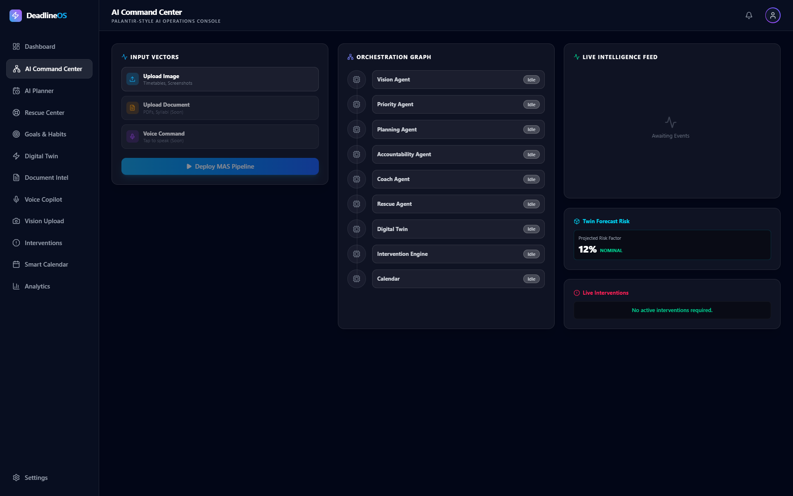
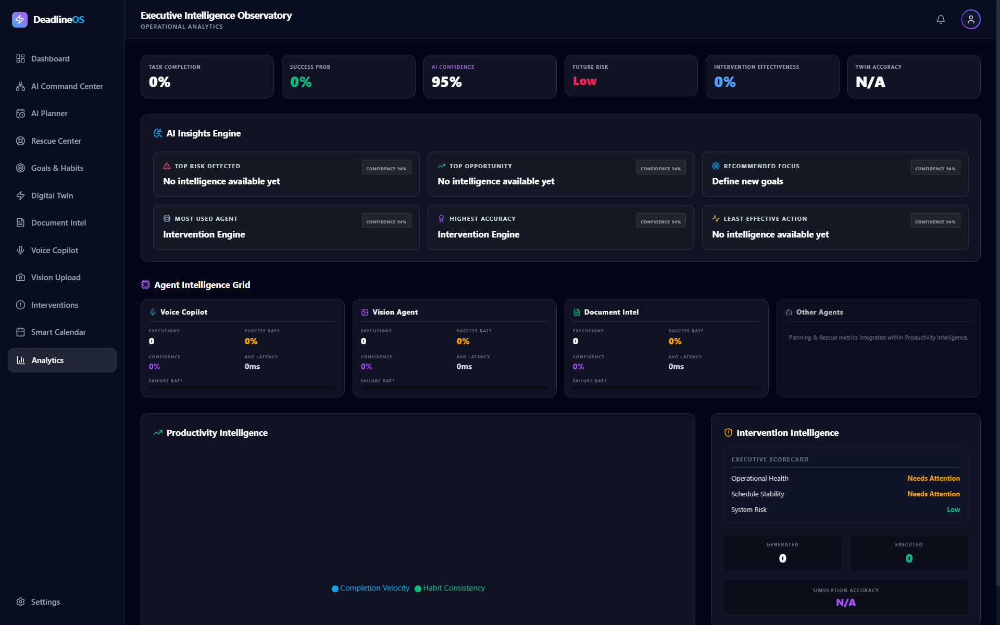
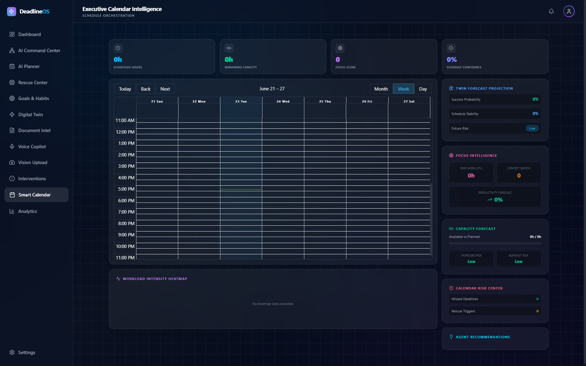
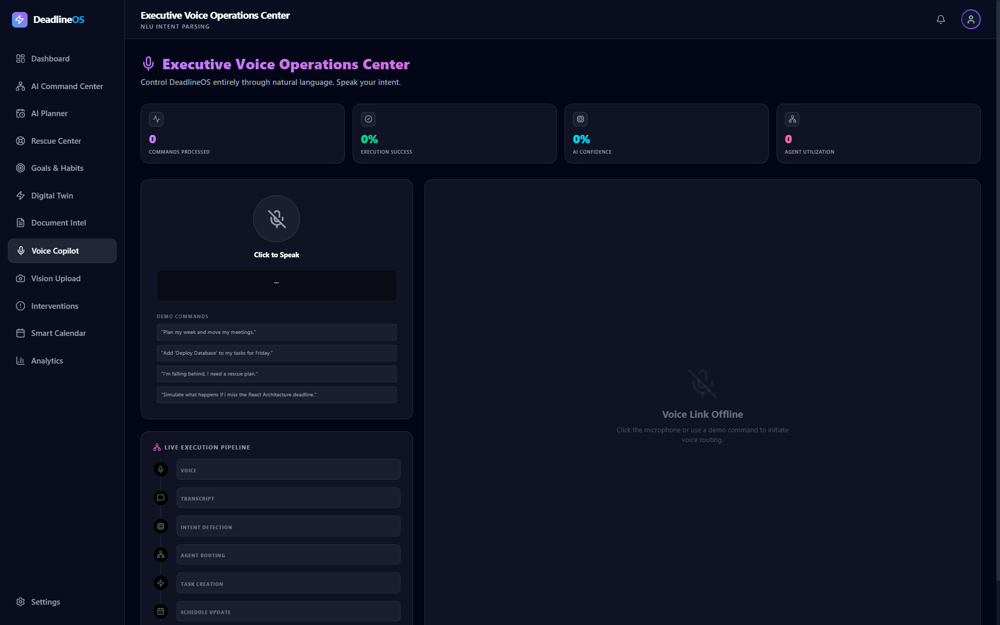
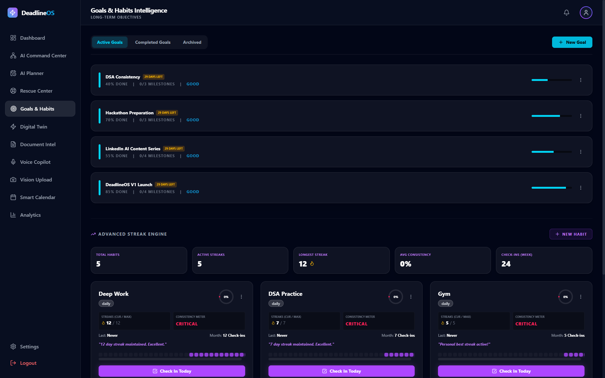
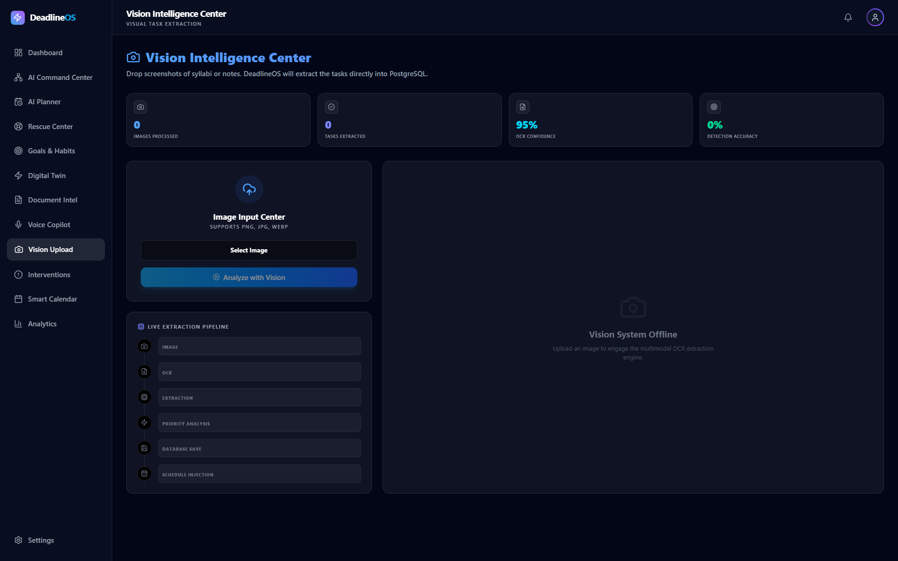
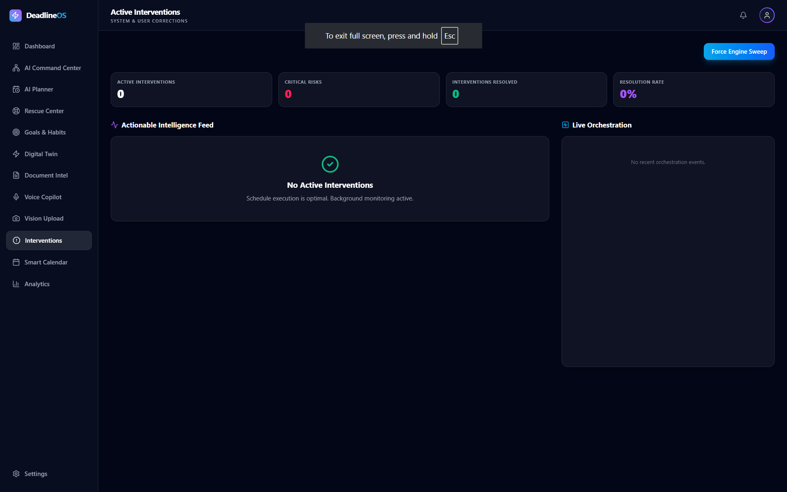
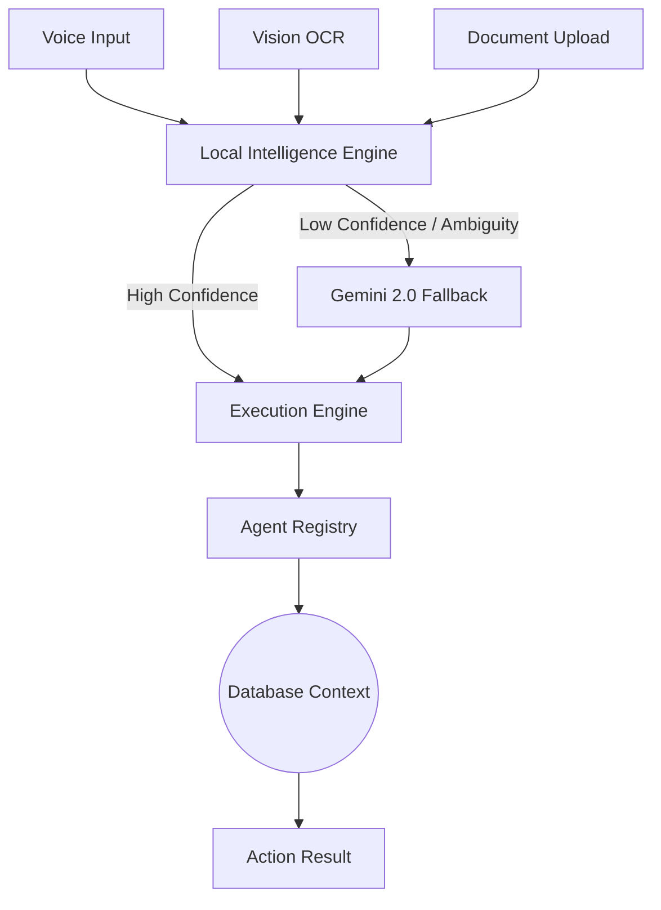

<!-- 1. Hero Banner -->
<div align="center">
  <h1>DeadlineOS</h1>
  <p><b>The Enterprise AI Executive Operating System</b></p>
  <p><a href="https://dead-line-os.vercel.app/"><b>🚀 View Live Demo</b></a></p>

  []()
  []()
  [](LICENSE)
  []()
</div>

---

## 2. Executive Overview
**What is DeadlineOS?**
DeadlineOS is a comprehensive, AI-native executive intelligence platform. It moves beyond passive task tracking into active schedule orchestration, simulating future workload capacity against real-world constraints to act as an autonomous Chief of Staff.

**The Problem Solved**
Traditional task managers fail because they wait for the user to miss deadlines. High-performance individuals suffer from schedule density blindness.

**Target Users**
Engineered for high-performance individuals, students, founders, and professional teams who require predictive analytics to avoid burnout and missed milestones.

**Key Differentiators**
- **Proactive Interventions**: Evaluates schedule integrity to intercept workload collisions before they happen.
- **Multimodal Intelligence**: Accepts commands via Voice, Vision (screenshots/whiteboards), and Documents.
- **Monte-Carlo Digital Twin**: Mathematically simulates your success rate on upcoming goals.

---

## 3. Key Features

**AI Planning & Coordination**
- **AI Planner**: Auto-schedules tasks by finding calendar whitespace without violating burnout thresholds.
- **Goals & Habits**: Tracks long-term objectives linked directly to daily atomic habits.
- **Smart Calendar**: Real-time aggregation of goals, meetings, and deadlines into a single pane of glass.

**Multimodal Intelligence**
- **Voice Intelligence**: Hands-free natural language parsing to execute complex CRUD workflows.
- **Vision Intelligence**: Extracts tasks and constraints from uploaded images or whiteboards.
- **Document Intelligence**: Semantically chunks PDFs and DOCX files into tracked milestones.

**Executive Defense**
- **Digital Twin**: Simulates completion trajectories by analyzing past velocity against future workload.
- **Rescue Center**: Detects at-risk tasks and auto-generates multi-step recovery strategies.
- **Command Center**: Global floating terminal for instant AI interactions from anywhere in the OS.

**Observability & Security**
- **Analytics**: Executive observatory tracking AI confidence scores and completion velocity.
- **Authentication**: Stateless, enterprise-grade tenant isolation.
- **Settings**: Complete control over AI aggressiveness, UI themes, and data management.

---

## 4. Screenshots

**Landing Page**


<details open>
<summary><b>Click to expand the Full Gallery</b></summary>
<br>

| Dashboards & Observability | Planning & Scheduling | AI Intelligence Inputs |
| :---: | :---: | :---: |
|  <br> **Dashboard** |  <br> **Planner** |  <br> **Command Center** |
|  <br> **Analytics** |  <br> **Calendar** |  <br> **Voice Copilot** |
|  <br> **Goals** |  <br> **Rescue Center** |  <br> **Vision Analysis** |
|  <br> **Digital Twin** |  <br> **Interventions** |  <br> **Document Extraction** |

*(Missing visual representations: Settings, Profile, Notifications due to PII isolation)*
</details>

---

## 5. Architecture
DeadlineOS relies on a Hybrid Inference Model built on modern cloud primitives.

- **Frontend**: A high-performance Vite SPA optimized for speed. Communicates via REST and WebSockets.
- **Backend**: A modular Python Application Factory. Implements a globally injected Local Intelligence Engine.
- **Database**: Connection-pooled serverless PostgreSQL optimized for multi-tenant isolation.
- **Authentication**: Asymmetric stateless JWT verification at the routing layer.
- **Deployment**: Vercel handles static edge caching; Render orchestrates the Python worker environments.
- **Local Intelligence Engine**: Processes basic NLP (intent classification, entity extraction) entirely on-device/in-memory with <150ms latency.
- **Gemini Fallback**: Used only when local confidence drops below a threshold, ensuring privacy and speed without sacrificing complex reasoning.

---

## 6. AI Architecture

The system standardizes all intelligence through a unified Execution Engine.


```mermaid
graph TD
    A[Voice Input] --> D
    B[Vision OCR] --> D
    C[Document Upload] --> D
    
    D[Local Intelligence Engine] -->|High Confidence| E[Execution Engine]
    D -->|Low Confidence / Ambiguity| F[Gemini 2.0 Fallback]
    
    F --> E
    
    E --> G[Agent Registry]
    G --> H((Database Context))
    H --> I[Action Result]
```

---

## 7. Tech Stack

- **Frontend**: React 19, TypeScript, Vite, TailwindCSS 4, Framer Motion
- **Backend**: Python 3.13, Flask, SQLAlchemy, Eventlet
- **Database**: Neon Serverless PostgreSQL
- **Authentication**: Supabase Auth (JWT)
- **Deployment**: Vercel (Client), Render (API)
- **AI**: Google Gemini 2.0 Flash + RapidFuzz (Local NLP)
- **Monitoring**: Sentry (Application Tracing)

---

## 8. Folder Structure

```text
DeadlineOS/
├── backend/
│   ├── api/            # API Route boundaries
│   ├── database/       # SQLAlchemy configuration
│   ├── models/         # ORM definitions
│   ├── scripts/        # Migrations and maintenance tools
│   ├── services/       # Core business & AI execution logic
│   └── utils/          # Security, auth, and error handlers
├── docs/               # Screenshots, archives, and certifications
├── frontend/
│   ├── public/         # Static assets
│   ├── src/
│   │   ├── api/        # Axios configurations
│   │   ├── components/ # Reusable React UI elements
│   │   ├── context/    # Global State (Auth, Theme)
│   │   ├── hooks/      # Custom React hooks
│   │   ├── lib/        # Utility libraries (Supabase)
│   │   └── pages/      # Route-level views
│   └── package.json    # Frontend dependencies
└── README.md
```

---

## 9. Installation

### 1. Database & External Services
- Create a **Neon PostgreSQL** database.
- Create a **Supabase** project.
- Obtain a **Google Gemini API Key**.

### 2. Environment Variables
Create `.env` files from `.env.example` templates in both `frontend/` and `backend/`.

### 3. Backend Setup
```bash
cd backend
python -m venv .venv
source .venv/bin/activate  # (Windows: .venv\Scripts\activate)
pip install -r requirements.txt
python app.py
```

### 4. Frontend Setup
```bash
cd frontend
npm install
npm run dev
```

---

## 10. Deployment

DeadlineOS is production-ready for standard platforms.

- **Render (Backend)**: Create a Web Service linked to your GitHub repo. Set Root Directory to `backend`. Build Command is `pip install -r requirements.txt`. Start Command is `gunicorn 'app:create_app()' --worker-class eventlet -w 1 --bind 0.0.0.0:$PORT`.
- **Vercel (Frontend)**: Link repo, set Framework Preset to `Vite`, Root Directory to `frontend`. Ensure `vercel.json` is present for SPA routing.
- **Neon**: Retrieve your Transaction Pooler URL (usually port 6543) and append `?sslmode=require`.
- **Supabase**: Update your Site URL and Redirect URLs to point to your Vercel domain.

---

## 11. Performance
DeadlineOS prioritizes perceived and absolute speed:
- **Local-First AI**: 90% of structural intelligence happens locally via NLP algorithms, bypassing network latency.
- **Lazy Loading**: Route-level React component chunking reduces initial bundle sizes to <300kb.
- **Optimistic Updates**: UI predicts successful backend executions instantly.
- **Caching**: The Execution Engine aggressively caches repeated Gemini prompts.

---

## 12. Security
- **JWT**: Stateless validation using Supabase's asymmetric signature verifications. No symmetric keys are manually shared.
- **Supabase Auth**: Strictly handles user identity and isolation natively.
- **Environment Variables**: No credentials committed. Git exclusions hardened.
- **Rate Limiting**: `flask-limiter` implemented at the global application boundary.
- **Input Validation**: Handled strictly via Marshmallow schemas and SQLAlchemy parameterized mapping to prevent SQLi/XSS.

---

## 3.5 Business OS (Commercial Enterprise Edition — B0 to B8 + Phase C1)

DeadlineOS includes a fully integrated, enterprise-grade **Business OS** operating alongside Personal OS with strict multi-tenant isolation and 5-tier RBAC:

- **Executive Command & KPIs** (`/business/dashboard`): Real-time liquidity telemetry, burn rate, runway projections, executive attention radar, and metric cards.
- **Decision Intelligence & Forecasting** (`/business/intelligence`): Deterministic cash flow models, 30/60/90-day scenario planning, and explainable decision briefs.
- **Financial Ledger & Invoicing** (`/business/invoices`, `/business/transactions`, `/business/partners`): Double-entry ledger with Python `Decimal` arithmetic, multi-currency support, and accountant CSV/PDF exports.
- **Operations & Work Allocation** (`/business/tasks`): Multi-tenant task queue, priority scheduling, facility/SKU linkage, status state machine, and member assignment.
- **Inventory & Stock Movements** (`/business/inventory`, `/business/locations`, `/business/products`): Immutable append-only movement ledger, derived stock valuation, zero-negative-stock protection, and atomic inter-location transfers.
- **Document Staging & AI Extraction** (`/business/staging`): Intelligent document OCR and receipt parsing with structured review before ledger or task commit.
- **Accounts Receivable Rescue** (`/business/rescue`): Overdue aging buckets (1-30, 31-60, 61-90, 90+), automated reminder drafting, and collection workflows.
- **Recurring Obligations & Automation** (`/business/recurring`): Automated recurring invoice generation and background task dispatchers with idempotent execution logs.
- **Multi-Entity & Consolidation** (`/business/entities`, `/business/consolidation`): Multi-subsidiary governance, inter-entity transfers, and consolidated multi-workspace financial views.
- **Governance, Audit & Security** (`/business/team`, `/business/audit`, `/business/settings`): 5-tier RBAC matrix (`OWNER`, `ADMIN`, `MEMBER`, `ACCOUNTANT`, `VIEWER`), immutable forensic audit logs, and workspace branding.
- **Production Health & Diagnostics** (`/business/health`): Non-mutating deep health telemetry across 7 subsystems, liveness/readiness probes, and 14-Gate Release Certification.

---

## 13. Roadmap
- **v1.0**: Personal OS (Core Planning, Digital Twin, Multimodal AI, Rescue Center). *(Completed & Frozen)*
- **v1.1**: Business OS Core (B0–B8 Multi-Tenant Ledger, Financial Forecasting, Consolidation). *(Completed & Frozen)*
- **v1.2**: Business Operations Foundation (Phase C1: Tasks, Products, Locations, and Inventory Ledger). *(Completed & Frozen)*
- **v2.0**: Native Mobile Apps (React Native) & Advanced Logistics/Supply Chain Intelligence.

---

## 14. Contributing

Contributions of all kinds are welcome — bug reports, feature suggestions,
documentation improvements, and code fixes.

See **[`CONTRIBUTING.md`](CONTRIBUTING.md)** for the full development workflow,
commit standards, and Pull Request guidelines.

See **[`USAGE.md`](USAGE.md)** for step-by-step local setup and best practices.

**Quick summary:**
1. [Open an Issue](https://github.com/sujith0466/DeadLine-OS/issues) to discuss your proposed change.
2. Fork the repository and create a feature branch.
3. Commit using [Conventional Commits](https://www.conventionalcommits.org/).
4. Open a Pull Request against `main`.

Ensure backend tests pass (`pytest tests/`) and the frontend lints cleanly (`npm run lint`).

---

## 15. License & Usage

DeadlineOS is distributed under the **[MIT License](LICENSE)** — one of the
most permissive open-source licenses available. You are free to use, copy,
modify, merge, publish, distribute, sublicense, and sell copies of this
software, provided the original copyright notice is retained.

See [`LICENSE`](LICENSE) for the complete, authoritative legal text.
See [`USAGE.md`](USAGE.md) for installation, setup, and deployment instructions.

### Community Guidelines

> ⚠️ The following are **community recommendations**, not additional legal
> restrictions. They do not modify or extend the MIT License in any way.

- **Preserve the copyright notice.** Keep the original
  `Copyright (c) 2026 Sujith Kumar Sanisetty` notice in all copies or
  substantial portions of the Software, as required by the MIT License.

- **Give credit when practical.** If you build a product, tutorial, or
  showcase on top of DeadlineOS, a visible attribution (e.g.,
  *"Built on DeadlineOS"*) is appreciated by the community.

- **Document significant modifications.** If you fork and significantly
  alter the project, noting your changes in a `CHANGELOG.md` or
  `MODIFICATIONS.md` helps downstream users understand what has changed.

- **Do not misrepresent your fork.** Avoid publishing a fork under the
  name "DeadlineOS" in a way that could cause confusion with the
  official project.

- **Contribute improvements back.** If you fix a bug or add a broadly
  useful feature, consider opening a Pull Request so the improvement
  can benefit the whole community.

---

## 16. Author
**Sujith Kumar Sanisetty**
- **LinkedIn**: [Connect on LinkedIn](https://www.linkedin.com/in/s-sujith-kumar-802059298)
- **GitHub**: [sujith0466](https://github.com/sujith0466)
