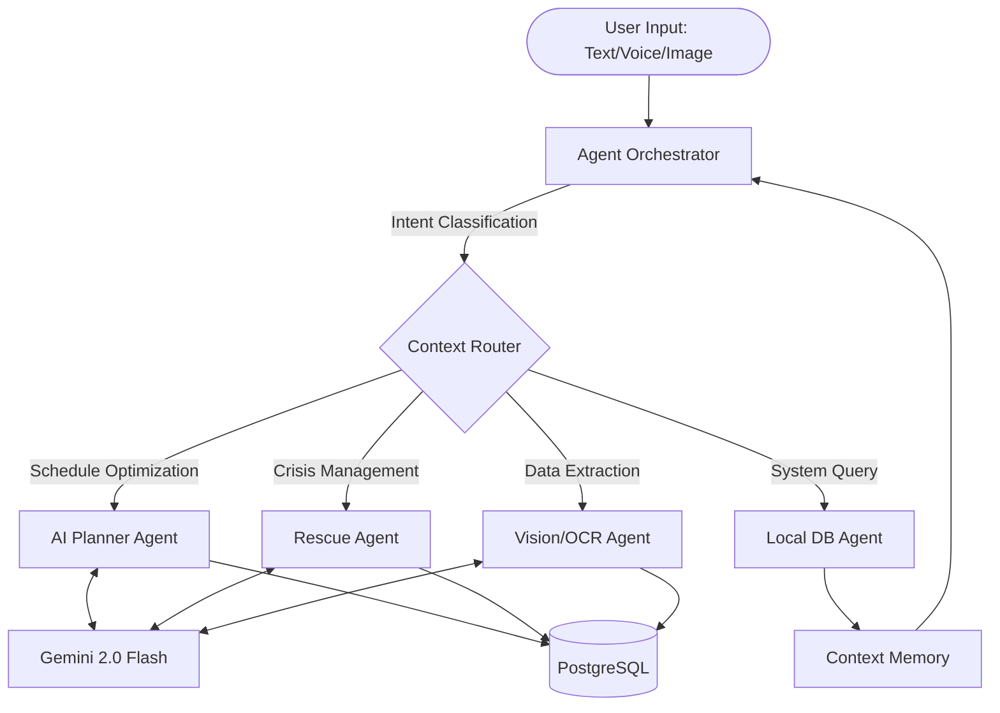
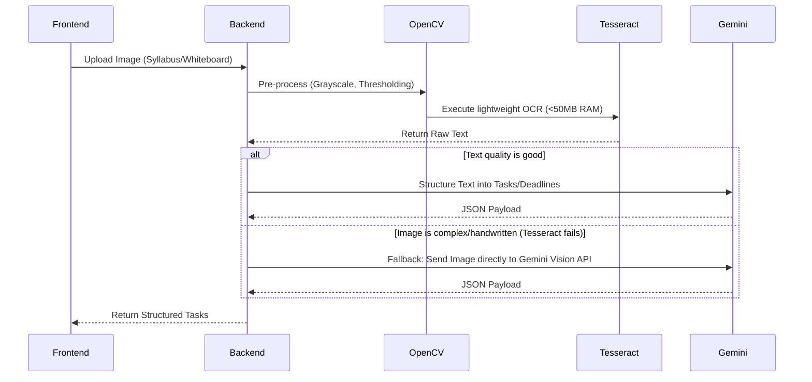
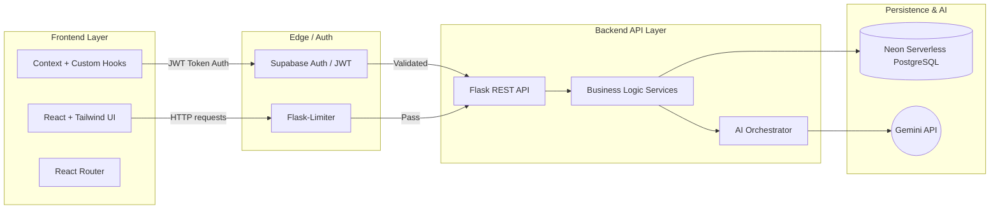
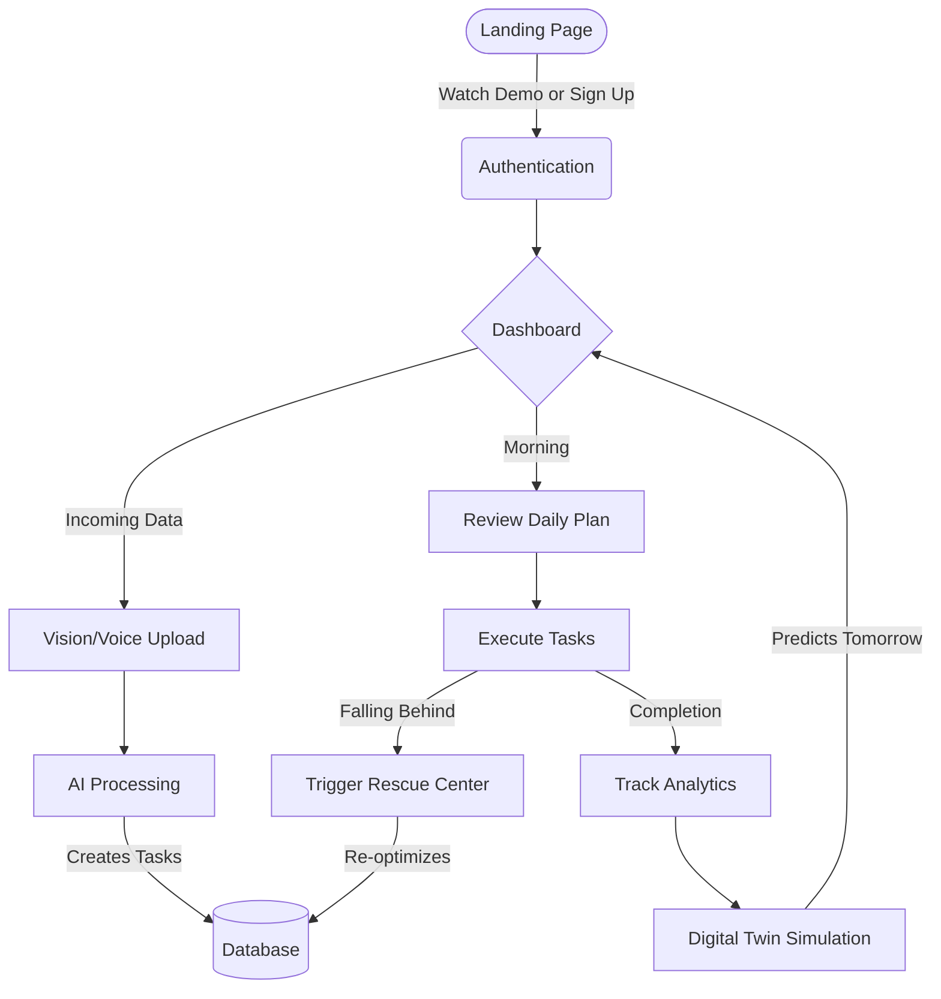

# DeadlineOS
### Your AI-Powered Personal Operating System

**Hackathon Submission:** AI Productivity Hackathon 2026  
**Team:** Sujith / DeadlineOS Team  
**Date:** June 2026  

 

**[Live Application](https://dead-line-os.vercel.app)** | **[Backend API](https://deadline-os.onrender.com)** | **[GitHub Repository](https://github.com/sujith0466/DeadLine-OS)**

---

## 2. Project Highlights

- **AI-Powered Personal Operating System:** An end-to-end cognitive assistant.
- **Autonomous Multi-Agent Architecture:** Task delegation to specialized LLM agents.
- **Digital Twin Simulation:** Predictive bottleneck modeling based on personal capacity.
- **Smart Goal Planning:** Bridging the gap between macro goals and daily micro-tasks.
- **Intelligent Calendar:** Fluid, auto-optimizing drag-and-drop scheduling.
- **Vision Intelligence:** Frictionless syllabus and whiteboard ingestion.
- **OCR + AI Hybrid Pipeline:** Scalable Tesseract to Gemini Fallback architecture.
- **Document Intelligence:** Parsing complex PDFs into actionable structured data.
- **Voice Copilot:** Hands-free semantic intent parsing.
- **Analytics Dashboard:** Actionable insights into focus and execution velocity.
- **Production Deployment:** Hardened, memory-optimized backend deployment.
- **Responsive UI:** Premium, glassmorphic design system using TailwindCSS.
- **JWT Authentication:** Secure, stateless session management.
- **Supabase Authentication:** Enterprise-grade identity provider.
- **PostgreSQL Database:** Serverless persistence via Neon.
- **Vercel + Render Deployment:** Edge network frontend with auto-scaling backend.

---

## 3. Executive Summary

In an era defined by cognitive overload and constant context switching, traditional task managers and calendars have become passive repositories for unfulfilled goals. They require immense manual effort to maintain, offering no active assistance when users are overwhelmed, distracted, or facing impending deadlines.

**DeadlineOS** is a revolutionary AI-Powered Autonomous Personal Operating System designed to eliminate the anxiety of execution. It does not merely store tasks; it actively orchestrates your goals, habits, and deadlines using a sophisticated Multi-Agent AI architecture. By combining predictive analytics, autonomous scheduling, computer vision, and a groundbreaking "Digital Twin" simulation engine, DeadlineOS anticipates failures before they occur and actively intervenes to keep you on track.

Built on a robust, production-grade enterprise architecture (React, TypeScript, Flask, PostgreSQL, Gemini AI, and Tesseract OCR), DeadlineOS is engineered for scale, speed, and resilience. It represents the paradigm shift from *passive task management* to *active execution intelligence*, helping students, developers, and professionals transform chaos into unstoppable momentum.

---

## 4. Problem Statement: The Execution Crisis

Knowledge workers, students, and freelancers operate in environments with infinite inputs and finite cognitive bandwidth. The modern execution crisis is characterized by:

- **Task Overload & Paralysis:** When users face a massive backlog of tasks without a clear execution sequence, the resulting cognitive friction leads to decision paralysis and chronic procrastination.
- **The Context-Switching Tax:** Switching between disparate tools for goals, daily tasks, calendars, and notes reduces productive capacity by up to 40%. The modern stack is deeply fragmented.
- **Burnout and Lack of Recovery:** Hyper-focusing on execution without integrated, intelligent recovery cycles leads to diminishing returns and eventual burnout. 
- **Missed Deadlines:** Passive systems do not warn users of cascading failures. If a foundational task is delayed, traditional calendars cannot simulate the downstream impact until it is too late.

### Limitations of Existing Solutions
Current market leaders (Todoist, Notion, Google Calendar) operate as **static databases**. They rely entirely on the user's discipline to categorize, prioritize, schedule, and execute. They do not understand the user's workload, they do not simulate future capacity, and they cannot autonomously restructure a day when unexpected delays occur. They are tools for *planning*, not *doing*.

---

## 5. Solution Overview: Autonomous Personal OS

**DeadlineOS** acts as an intelligent, autonomous co-pilot for your life. It operates across five core cognitive pillars:

1. **Intelligent Planning:** Autonomous multi-agent pipelines parse raw brain-dumps, images, and voice notes, converting them into structured, estimated, and prioritized action items.
2. **Dynamic Execution:** The Smart Calendar and Dashboard actively route the user's attention to the highest-leverage task at any given moment, adapting in real-time to missed targets.
3. **Proactive Recovery:** The Rescue Center monitors execution velocity and focus metrics. If it detects burnout patterns, it dynamically injects recovery blocks into the schedule.
4. **Predictive Simulation:** The Digital Twin V2 engine runs Monte Carlo-style simulations on the user's schedule, identifying future bottlenecks and cascading failure risks days in advance.
5. **Decision Intelligence:** By centralizing Goals, Habits, and Tasks, the AI understands the *context* of a user's life, ensuring daily micro-actions perfectly align with macro-objectives.

---

## 6. Screenshots

### Landing Page

### Dashboard

### AI Planner

### Smart Calendar

### AI Command Center

---

## 7. Key Features & Modules

DeadlineOS is composed of deeply integrated, highly specialized modules.

### 7.1 Dashboard
* **Purpose:** The centralized command center for daily execution.
* **Workflow:** Aggregates immediate tasks, today's schedule, habit streaks, and top-level goals into a single glassmorphic, premium UI.
* **Benefits:** Eliminates the need to check multiple apps to know "what's next."
* **Business Value:** Increases daily active user retention by providing a high-utility, zero-friction landing zone.

### 7.2 AI Command Center
* **Purpose:** A universal, natural-language interface to control the entire operating system.
* **Workflow:** Users can type or speak ("Schedule a 2-hour deep work block for my physics paper tomorrow"). The Multi-Agent Orchestrator parses the intent, queries the database, and executes the mutations autonomously.
* **Benefits:** Drastically reduces the time required to manage the system.

### 7.3 AI Planner
* **Purpose:** Autonomous schedule optimization.
* **Workflow:** Analyzes the user's pending tasks, deadlines, and available calendar whitespace. It then packs tasks into the schedule using time-blocking strategies, respecting user-defined working hours.
* **Benefits:** Removes the cognitive load of manual scheduling, resolving decision paralysis.

### 7.4 Goals & Habits
* **Purpose:** Aligning long-term vision with daily action.
* **Workflow:** Users define macro-goals and daily habits. The system automatically links daily tasks to these goals and tracks habit consistency.
* **Benefits:** Provides a clear "why" behind the daily grind, significantly increasing motivation.

### 7.5 Rescue Center
* **Purpose:** Emergency intervention for overwhelmed users.
* **Workflow:** If a user falls behind, they trigger the Rescue Center. The AI pauses non-essential tasks, aggressively filters the backlog, and creates a highly structured, step-by-step "survival plan."
* **Business Value:** A highly unique market differentiator that turns a moment of user churn into a moment of extreme value delivery.

### 7.6 Digital Twin
* **Purpose:** Predictive risk modeling and schedule simulation.
* **Workflow:** Simulates the upcoming week based on task estimations and historical completion rates, highlighting "Collision Zones" where required workload exceeds capacity.
* **Benefits:** Prevents missed deadlines by warning the user proactively.

### 7.7 Smart Calendar
* **Purpose:** A fluid, dynamic time-blocking interface.
* **Workflow:** Visualizes the AI's generated schedule alongside manual entries. Supports drag-and-drop rescheduling that immediately syncs with the database and updates underlying task deadlines.

### 7.8 Vision & Document Intelligence
* **Purpose:** Frictionless ingestion of unstructured real-world data.
* **Workflow:** Users upload a photo of a whiteboard or syllabus. The hybrid OCR pipeline extracts text, and the Gemini AI structures it into actionable tasks.

### 7.9 Voice Copilot
* **Purpose:** Hands-free, rapid task capture.
* **Workflow:** Real-time speech-to-text processing feeds directly into the AI Command Center, allowing users to brainstorm while walking or driving.

### 7.10 Analytics
* **Purpose:** Deep insights into personal execution metrics.
* **Workflow:** Tracks velocity, focus hours, completion rates, and habit consistency over time, presenting them in interactive charts.

---

## 8. AI Architecture: Hybrid Intelligence Pipeline

DeadlineOS utilizes a sophisticated **Multi-Agent Hybrid Architecture**. Instead of relying on a single monolithic LLM prompt, the system dynamically routes intents to specialized agent personas, dramatically reducing hallucination rates and increasing execution speed.

### Core AI Components
1. **Gemini 2.0 Flash:** Serves as the primary reasoning engine, chosen for its exceptional speed and massive context window, enabling real-time conversational UX.
2. **Context Memory Injection:** Before any agent acts, it is injected with the user's current state (pending tasks, today's schedule, active goals). This ensures the AI never gives generic advice; it operates within the strict parameters of the user's reality.
3. **Tool Use (Function Calling):** The AI operates deterministically. It generates structured JSON payloads that map directly to backend API mutations (e.g., `create_task`, `reschedule_event`), ensuring strict type safety and data integrity.

---

## 9. OCR Architecture: Migration to Production

A major engineering milestone in DeadlineOS was architecting a robust, lightweight Computer Vision pipeline suitable for production cloud environments.

### The Problem (EasyOCR)
Initially, the system utilized EasyOCR (PyTorch). While highly accurate, this architecture was fundamentally incompatible with cost-effective serverless deployments. The PyTorch dependency consumed over 500MB+ of RAM simply to initialize, resulting in catastrophic Out-Of-Memory (OOM) crashes on standard 512MB cloud instances. Furthermore, cold-start times exceeded 15 seconds.

### The Solution (Tesseract + Gemini Fallback)
To achieve production readiness, we architected a lightning-fast Hybrid OCR Provider.

**Production Value:**
- **RAM Reduction:** Dropped OCR memory consumption by 90% (from 500MB+ to under 50MB).
- **Speed:** Tesseract executes in milliseconds compared to heavy PyTorch tensor operations.
- **100% Resilience:** The Decision Engine gracefully falls back to Gemini's native multi-modal capabilities if Tesseract encounters complex handwriting, guaranteeing success without burdening the local server.

---

## 10. System Architecture

DeadlineOS relies on a modern, decoupled client-server architecture, ensuring strict separation of concerns, high security, and massive scalable performance.

---

## 11. Technology Stack

DeadlineOS leverages a highly performant stack carefully selected for developer velocity, robust typing, and enterprise-grade scalability.

### Frontend
| Technology | Purpose | Justification |
| :--- | :--- | :--- |
| **React 18** | UI Framework | Component-driven architecture, vast ecosystem. |
| **TypeScript** | Language | Strict type safety, self-documenting code, zero runtime type errors. |
| **Vite** | Build Tool | Lightning-fast HMR, optimized production bundles. |
| **Tailwind CSS** | Styling | Utility-first, highly maintainable, eliminates dead CSS. |
| **Framer Motion** | Animations | Premium, hardware-accelerated micro-interactions. |
| **React Router** | Routing | Client-side navigation, nested routes, route protection. |

### Backend
| Technology | Purpose | Justification |
| :--- | :--- | :--- |
| **Python 3.10+** | Language | Dominant AI ecosystem compatibility, rapid prototyping. |
| **Flask** | API Framework | Lightweight, unopinionated, highly extensible microframework. |
| **SQLAlchemy** | ORM | Secure query generation, complex relational mapping, protection against SQLi. |
| **Flask-Limiter** | Security | In-memory rate limiting to prevent abuse and DDoS. |

### Infrastructure & Services
| Technology | Purpose | Justification |
| :--- | :--- | :--- |
| **Neon** | Database | Serverless PostgreSQL. Auto-scaling compute, instant branching. |
| **Supabase** | Authentication | Enterprise-grade JWT authentication, secure session management. |
| **Google Gemini API**| LLM Provider | Massive context window, multi-modal vision capabilities, high speed. |
| **Tesseract/OpenCV** | Computer Vision | Lightweight, battle-tested OCR without ML framework bloat. |
| **Vercel** | Frontend Edge | Global CDN, immutable deployments, SSL. |
| **Render** | Backend Hosting | Zero-downtime deployments, managed Python environments. |

---

## 12. Production Engineering

DeadlineOS has undergone rigorous production hardening to transition from prototype to an enterprise-grade platform.

### 12.1 Infrastructure Optimization
By migrating away from heavy PyTorch dependencies, the Docker image footprint was drastically reduced. Base RAM utilization dropped to under 100MB, allowing the application to scale horizontally on cost-effective cloud instances without encountering OOM killer terminations.

### 12.2 Advanced Rate Limiting Architecture
To protect critical AI infrastructure, we implemented a dual-layer rate limiting strategy:
- **Global Constraints:** 10,000 requests/day and 1,000 requests/hour to prevent generic API abuse.
- **Endpoint Specific:** Aggressive limiting on high-cost AI execution routes (e.g., `/api/agents/plan`) and Authentication paths.
- **CORS Preflight Engineering:** The rate limiter is explicitly configured to bypass `OPTIONS` preflight requests, a critical architectural fix that prevents modern browsers from silently failing cross-origin requests.

### 12.3 Interactive State Persistence
The Smart Calendar features intuitive drag-and-drop rescheduling. Previously a superficial UI change, the system is now engineered to parse new time boundaries, convert them safely into `timezone.utc`, update underlying SQLAlchemy Task models, and execute atomic database commits. The UI and the Database remain perfectly synchronized.

### 12.4 Production Quality Assurance (QA)
We developed a comprehensive Python validation suite that programmatically audits the deployment. Prior to release, it tests database schemas, route protections (enforcing `401 Unauthorized` for missing JWTs), CORS headers, Limiter configurations, and AI service initialization, guaranteeing a zero-regression deployment.

---

## 13. Authentication & Security

Security is deeply embedded into DeadlineOS at every tier of the stack:

- **Stateless Authentication:** Uses industry-standard JWT (JSON Web Tokens) generated by Supabase. The Flask backend verifies the token signature locally using the Supabase JWT Secret. Zero session state is stored in server memory.
- **Unified Auth Flows:** Disparate login systems were refactored into a highly cohesive, unified `useDemoLogin` hook. Whether a user clicks "Watch Demo" or "Quick Access," they traverse the exact same secure authentication pipeline.
- **Route Authorization:** A custom `@require_auth` decorator validates the `Authorization: Bearer <token>` header on every protected API route, guaranteeing strict tenant data isolation.
- **Input Validation & Sanitization:** All incoming JSON payloads are aggressively type-checked. Dates are strictly parsed into ISO 8601 format to prevent injection attacks or database corruption.
- **Secure Environment Management:** Critical secrets (API Keys, Database URIs) are injected securely via Render/Vercel CI/CD pipelines and are never committed to source control.

---

## 14. Scalability & Performance

- **Edge Deployment:** The React application is built via Vite and deployed to Vercel's Edge Network, guaranteeing sub-50ms TTFB (Time to First Byte) globally alongside automated SSL provisioning.
- **Serverless PostgreSQL:** The Neon database operates on a serverless paradigm. Compute scales to zero during inactivity to save costs and scales up instantly upon receiving high throughput.
- **Vite Bundling:** The frontend code compiles to an incredibly minimal footprint (e.g., the complex Calendar chunks are highly optimized and compressed).
- **Asynchronous AI Operations:** Deep AI processing is handled asynchronously where possible, providing the user with optimistic UI updates while the backend crunches data without blocking the main thread.

---

## 15. User Workflow Lifecycle

---

## 16. Competitive Analysis

DeadlineOS does not just manage tasks; it actively manages *execution*. 

| Feature | DeadlineOS | Todoist | Notion | Google Calendar | Motion |
| :--- | :---: | :---: | :---: | :---: | :---: |
| **Manual Task Entry** | ✅ | ✅ | ✅ | ✅ | ✅ |
| **Calendar View** | ✅ | ❌ | ⚠️ | ✅ | ✅ |
| **Autonomous Scheduling** | ✅ | ❌ | ❌ | ❌ | ✅ |
| **Burnout/Recovery Interventions**| ✅ | ❌ | ❌ | ❌ | ❌ |
| **Predictive Digital Twin** | ✅ | ❌ | ❌ | ❌ | ❌ |
| **Vision/Voice Parsing** | ✅ | ⚠️ | ❌ | ❌ | ❌ |
| **Goal Alignment** | ✅ | ❌ | ✅ | ❌ | ❌ |

**The DeadlineOS Advantage:** While tools like Motion offer auto-scheduling, they are purely algorithmic. DeadlineOS introduces deep cognitive context. It knows *why* you are doing a task (Goals), it monitors your *velocity* (Analytics), and it actively *intervenes* when you are stressed (Rescue Center). It is a holistic life operating system, not just an enterprise scheduling tool.

---

## 17. Business Impact & Market Opportunity

**Target Audience:**
- **High-Performance Students:** Managing complex syllabi, overlapping midterms, and extracurriculars.
- **Freelancers & Indie Hackers:** Individuals acting as their own project managers, developers, and marketers simultaneously.
- **Knowledge Workers:** Professionals suffering from meeting overload and struggling to carve out deep-work blocks.

**The Market:**
The global productivity software market is projected to reach $122.7 Billion by 2030. However, user fatigue with "empty databases" is at an all-time high. DeadlineOS represents the next paradigm: **Agentic Productivity**. The opportunity lies in capturing the segment of the market that is willing to pay a premium for software that *does the work for them*, rather than software that creates *more work to manage*.

---

## 18. Future Roadmap

The version 1.0.0 release establishes the foundational layer. The next 12-18 months will focus on ecosystem integration and ubiquitous access.

1. **Ecosystem Sync:** Two-way synchronization with Google Calendar, Microsoft Outlook, and Apple Calendar.
2. **Ubiquitous Access:** Cross-platform Mobile Applications (iOS/Android) and progressive web app (PWA) capabilities for offline mode.
3. **Hardware Integration:** Apple Watch and WearOS integrations for instant voice capture and biometric-triggered Rescue interventions (e.g., detecting high heart rate and autonomously suggesting a break).
4. **Model Context Protocol (MCP):** Allowing DeadlineOS agents to securely query external tools (GitHub, Jira, Figma) to track task progress autonomously without user input.
5. **Team Workspaces:** Extending the Digital Twin to simulate team capacity, optimizing project assignments based on individual developer velocity and burnout risk.

---

## 19. Conclusion

DeadlineOS stands at the intersection of beautiful consumer software and cutting-edge artificial intelligence. 

By replacing passive task lists with a proactive, autonomous, and empathetic Multi-Agent architecture, DeadlineOS actively fights the modern crisis of cognitive overload. It is engineered with extreme care, utilizing a highly optimized, production-hardened stack capable of scaling efficiently. 

DeadlineOS is not just a hackathon concept—it is a fully realized, deployment-ready product that redefines how humans interface with their own ambitions. It is the definitive Personal Operating System for the AI era.

---

## 20. Why DeadlineOS?

DeadlineOS is more than a productivity application—it is an AI-powered Personal Operating System that transforms user intent into executable action through autonomous planning, intelligent scheduling, contextual memory, and multi-agent reasoning. Built with production-grade engineering practices and deployed on a scalable cloud architecture, DeadlineOS demonstrates how AI can move beyond assistance to active execution while maintaining transparency and human control.
